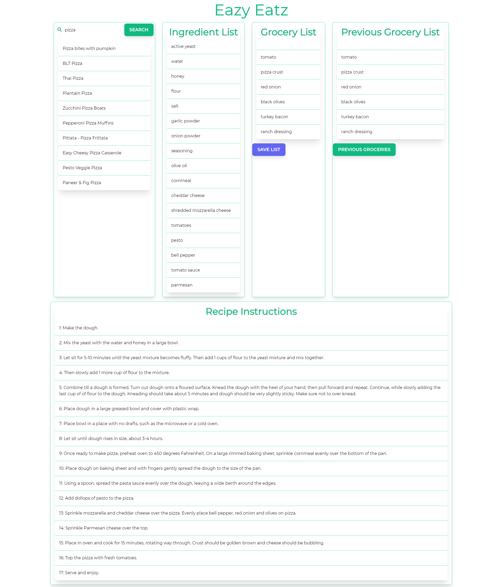

<h1 align="center">
    Eazy Eatz
</h1>

<h2 align="center">
    Group Project 1 - Module 7 & Module 8
</h2>

<h1 align="center">
    <a href="https://fremen432.github.io/Eazy-Eatz/" target="_blank">
     View Demo
    </a>
</h1>

<!-- Table of Contents -->
<details open="open">
  <summary>Table of Contents</summary>
  <ol>
    <li>
      <a href="#about-the-project">About The Project</a>
      <ul>
        <li><a href="#user-story">User Story</a></li>
        <li><a href="#acceptance-criteria">Acceptance Criteria</a></li>
        <li><a href="#project-requirements">Project Requirements</a></li>
        <li><a href="#built-with">Built With</a></li>
      </ul>
    </li>    
    <li><a href="#contributing">Contributing</a>
    <li><a href="#contact">Contact</a>
    <li><a href="#acknowledgements">Acknowledgements</a></li>
    </li>
  </ol>
</details>

<!-- About the Project -->

## About the Project

<div align="center">
     
</div>

<!-- User Story -->

### User Story

```
AS A person who wants to eat a nutritious meal,
I WANT an application that can give me ideas for different nutritious recipes based on a few given criteria,
SO THAT I can find a recipe for a nutritious meal.
GIVEN I have a recipe I want to cook,
I ALSO WANT an application that can list the ingredients I need for that recipe, display them in a shopping list and include step-by-step instructions on of how to cook the meal,
SO THAT I know what ingredients I will need to buy and I will know how to cook the meal.
```

<!-- Acceptance Criteria -->

### Acceptance Criteria

```
GIVEN I am using an application that generates ingredients for a recipe,
WHEN I enter recipe specifications in the search bar,
THEN I am presented with multiple recipe options related to my given specifications,
WHEN I choose which recipe I want to cook,
THEN I am presented with a list of ingredients that make up that recipe,
WHEN I drag which ingredients I want into the grocery list and click the "Save List" button,
THEN I my grocery list is saved to local storage,
WHEN I click the "Previous Groceries" button,
THEN the ingredients of any previous grocery list will be populated in the Previous Grocery list,
WHEN I look at the recipe instructions, 
THEN I see step-by-step instructions for how to cook my selected meal.

```

<!-- Project Requirements -->

### Project Requirements

- Use a CSS framework other than Bootstrap.
- Be deployed to GitHub Pages.
- Be interactive (i.e., accept and respond to user input).
- Use at least two server-side API's.
- Does not use alerts, confirms, or prompts (use modals).
- Use client-side storage to store persistent data.
- Be responsive.
- Have a polished UI.
- Have a clean repository that meets quality coding standards (file structure, naming conventions, follows best practices for class/id naming conventions, indentation, quality comments, etc.).
- Have a quality README (with unique name, description, technologies used, screenshot, and link to deployed application).

<!-- Built With -->

### Built With

- [HTML](https://developer.mozilla.org/en-US/docs/Web/HTML)
- [CSS](https://developer.mozilla.org/en-US/docs/Web/CSS)
- [JavaScript](https://developer.mozilla.org/en-US/docs/Web/JavaScript)
- [TailwindCSS](https://tailwindcss.com/)
- [jQuery](https://jquery.com)
- [Spoonacular](https://spoonacular.com/food-api/docs)

<!-- CONTRIBUTING -->

# Contributing

Contributions are what make the open source community such an amazing place to learn, inspire, and create. Any contributions you make are **greatly appreciated**.

1. Fork the Project
2. Create your Feature Branch (`git checkout -b feature/AmazingFeature`)
3. Commit your Changes (`git commit -m 'Add some AmazingFeature'`)
4. Push to the Branch (`git push origin feature/AmazingFeature`)
5. Open a Pull Request

<!-- CONTACT -->

# Contact

- [Clayton](https://github.com/fremen432)

- [Dakota](https://github.com/Dakota3214)

- [David](https://github.com/somdobomk)

- [Mickey](https://github.com/MickeyPhillips)

## Acknowledgements

- [GitHub Emoji Cheat Sheet](https://www.webpagefx.com/tools/emoji-cheat-sheet)
- [Img Shields](https://shields.io)
- [Choose an Open Source License](https://choosealicense.com)
- [GitHub Pages](https://pages.github.com)
- [Font Awesome](https://fontawesome.com)
